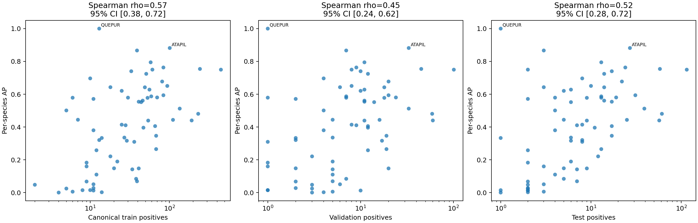
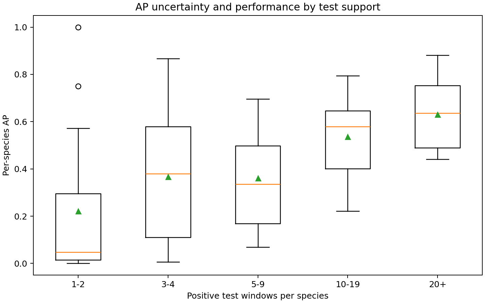
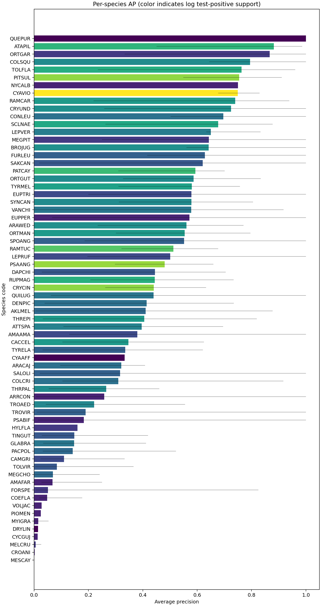

# Per-Species AP and Data Representation Analysis

## Why

This analysis asks whether species with more representation in the actual training, validation,
and test data obtain higher average precision (AP). Correlations are across the 68 species,
not across windows, and therefore describe association rather than causation.

## Main Result

Per-species AP increases moderately with representation in the unfiltered 68-species analysis.
The strongest unadjusted association is with canonical train positives, while test-positive support
also has a strong association because thin test sets produce high-variance AP estimates. Training and
test supports are themselves highly correlated by the stratified split, so their effects cannot be
cleanly separated observationally.

| predictor | spearman_rho | spearman_ci_low | spearman_ci_high | spearman_q_bh | pearson_log1p_r |
| --- | --- | --- | --- | --- | --- |
| train_canonical_windows | 0.573 | 0.376 | 0.724 | 0.000 | 0.545 |
| val_windows | 0.448 | 0.245 | 0.621 | 0.000 | 0.429 |
| test_windows | 0.521 | 0.276 | 0.719 | 0.000 | 0.485 |

After controlling for test-positive support, the partial rank association between canonical train
positives and AP is 0.303 (BH-adjusted q=0.0606). The distinct-train-audio association largely disappears after this control, indicating that window
support and split-wide species commonness are more closely associated with the observed pattern than
audio-file count alone.

The association weakens when thin-test species are removed. For canonical train windows, Spearman
rho changes from 0.573 (68 species) to 0.433 for `test_pos>=5` and 0.203 for `test_pos>=10`. Thus, the raw correlation should not be read as a stable dose-response relationship.

## Test-Support Strata

| test_support_bin | n_species | mean_ap | median_ap | std_ap | min_ap | max_ap |
| --- | --- | --- | --- | --- | --- | --- |
| 1-2 | 15 | 0.221 | 0.048 | 0.314 | 0.001 | 1.000 |
| 3-4 | 9 | 0.366 | 0.380 | 0.302 | 0.006 | 0.867 |
| 5-9 | 19 | 0.360 | 0.336 | 0.196 | 0.069 | 0.697 |
| 10-19 | 15 | 0.537 | 0.579 | 0.173 | 0.221 | 0.795 |
| 20+ | 10 | 0.630 | 0.636 | 0.157 | 0.440 | 0.882 |

Species with only one or two positive test windows have highly unstable AP: their mean is lower, but
the range includes both near-zero values and AP=1.0. The support-restricted macro-AP values in the
main results (>=5 and >=10 positives) are therefore more stable summaries than the all-species value.

Distinct positive audio files give a more independent support view than window counts:

| test_sound_bin | n_species | mean_ap | median_ap | std_ap | min_ap | max_ap |
| --- | --- | --- | --- | --- | --- | --- |
| 1 | 10 | 0.233 | 0.027 | 0.359 | 0.001 | 1.000 |
| 2-3 | 25 | 0.405 | 0.445 | 0.266 | 0.006 | 0.867 |
| 4-9 | 26 | 0.447 | 0.427 | 0.228 | 0.069 | 0.882 |
| 10+ | 7 | 0.533 | 0.481 | 0.158 | 0.347 | 0.754 |

Ten species have positives from only one test audio file. Their AP confidence interval is marked
non-estimable because resampling cannot create independent positive evidence that does not exist.

## Highest AP Species

| code | species | ap | ap_ci_low | ap_ci_high | test_positive_sound_ids | train_canonical_windows | train_canonical_sound_ids | test_windows |
| --- | --- | --- | --- | --- | --- | --- | --- | --- |
| QUEPUR | Querula purpurata | 1.000 | NA | NA | 1 | 13 | 9 | 1 |
| ATAPIL | Atalotriccus pilaris | 0.882 | 0.450 | 0.986 | 4 | 101 | 12 | 27 |
| ORTGAR | Ortalis garrula | 0.867 | 0.333 | 1.000 | 2 | 39 | 12 | 3 |
| COLSQU | Columbina squammata | 0.795 | 0.644 | 1.000 | 3 | 58 | 16 | 13 |
| TOLFLA | Tolmomyias flaviventris | 0.763 | 0.235 | 0.961 | 5 | 84 | 14 | 24 |
| PITSUL | Pitangus sulphuratus | 0.754 | 0.549 | 0.911 | 11 | 243 | 56 | 58 |
| NYCALB | Nyctidromus albicollis | 0.750 | NA | NA | 1 | 61 | 10 | 2 |
| CYAVIO | Cyanocorax violaceus | 0.750 | 0.677 | 0.829 | 42 | 447 | 155 | 115 |
| RAMCAR | Ramphocelus carbo | 0.740 | 0.219 | 0.939 | 6 | 33 | 13 | 17 |
| CRYUND | Crypturellus undulatus | 0.724 | 0.258 | 1.000 | 7 | 51 | 28 | 14 |

## Lowest AP Species

| code | species | ap | ap_ci_low | ap_ci_high | test_positive_sound_ids | train_canonical_windows | train_canonical_sound_ids | test_windows |
| --- | --- | --- | --- | --- | --- | --- | --- | --- |
| MESCAY | Mesembrinibis cayanensis | 0.001 | NA | NA | 1 | 4 | 4 | 1 |
| CROANI | Crotophaga ani | 0.003 | NA | NA | 1 | 14 | 6 | 2 |
| MELCRU | Melanerpes cruentats | 0.006 | 0.001 | 0.026 | 2 | 6 | 4 | 3 |
| CYCGUJ | Cyclarhis gujanensis | 0.013 | NA | NA | 1 | 11 | 6 | 2 |
| DRYLIN | Dryocopus lineatus | 0.015 | NA | NA | 1 | 8 | 5 | 1 |
| MYIGRA | Myiozetetes granadensis | 0.016 | 0.001 | 0.054 | 2 | 10 | 6 | 2 |
| PIOMEN | Pionus menstruus | 0.025 | NA | NA | 1 | 5 | 4 | 2 |
| VOLJAC | Volatinia jacarina | 0.028 | NA | NA | 1 | 11 | 7 | 2 |
| COEFLA | Coereba flaveola | 0.048 | 0.019 | 0.177 | 2 | 2 | 2 | 2 |
| FORSPE | Forpus spengeli | 0.051 | 0.006 | 0.825 | 2 | 11 | 6 | 3 |

## Interpretation

- More represented species generally perform better in the full descriptive analysis, supporting
  annotation quantity as one constraint, but the relationship weakens in better-supported subsets.
- Canonical train support correlates slightly more strongly with AP than augmented train support;
  overlapping augmentation increases volume but not independent evidence.
- Train augmentation inflates positive-window support by 2.45x to 7.18x across species (mean 3.71x).
- Test support affects both metric stability and observed correlation. It must not be interpreted as
  a causal improvement in the trained classifier.
- Validation support is associated with AP, but the validation set only selected one global C; it did
  not tune a separate classifier per species.
- AP lift above prevalence gives nearly the same correlations, so the result is not explained only by
  AP's test-metric prevalence floor. It does not remove broader species-commonness confounding.
- Distinct train audio files have little residual association after controlling test support; species
  commonness and window volume remain more strongly associated than recording count alone.
- In the `test_pos>=10` subset, the train-audio-file correlation becomes weakly negative and
  non-significant, reinforcing that the full-data association is not a stable dose-response.

## Limitations

1. All support variables are strongly correlated because the split was stratified by species.
2. The unit of correlation is species (n=68); bootstrap intervals resample species and do not capture
   uncertainty from re-splitting or retraining.
3. AP for thin-support species is discrete and unstable. A single positive can produce AP=1.0.
4. Window counts are not independent biological events; canonical windows and distinct sound IDs are
   reported to expose this distinction.
5. This analysis is descriptive and cannot establish that adding a specific number of annotations will
   cause a corresponding AP increase.

## Reproducible Artifacts

- `analysis/ap_support_per_species.csv`
- `analysis/ap_support_correlations.csv`
- `analysis/ap_support_partial_correlations.csv`
- `analysis/ap_by_test_support_bin.csv`
- `analysis/ap_by_test_sound_bin.csv`
- `analysis/ap_support_correlation_sensitivity.csv`
- `figures/ap_vs_support.png`
- `figures/ap_by_species.png`
- `figures/ap_by_test_support_bin.png`
